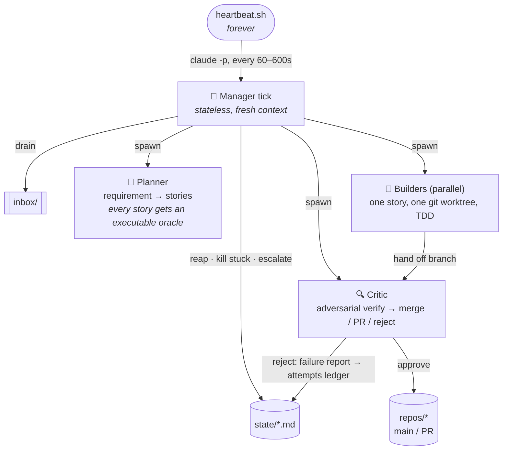

<div align="center">


# Séance

**Summon the spirits. Ship the backlog.**

An autonomous development-agent orchestrator that runs a fleet of Claude Code agents
against your repos — for days at a time, unattended.

[](https://github.com/nikrich/seance/releases)
[](LICENSE)
[](bin/heartbeat.sh)
[](https://claude.com/claude-code)

*Part of the ghost ecosystem, alongside* [**Poltergeist**](https://github.com/nikrich/poltergeist) *— a local-first second brain.*

</div>

---

Séance is deliberately almost code-free. The entire system is:

- **one bash script** — [`bin/heartbeat.sh`](bin/heartbeat.sh), a dumb loop that never gets smarter
- **a directory convention** — every piece of orchestration state is a markdown file you can read, grep, and edit
- **five skills** — prompts that carry all of the intelligence

There is no server, no database, no queue, no framework. Files are the single source of
truth, git history is the memory, and every agent runs with a fresh context and a bounded
job. That combination — not a bigger model or a cleverer prompt — is what makes multi-day
autonomy hold up.

## How it works



One tick at a time, the manager drains the inbox, reaps finished agents, and spawns
planners, builders, and critics as detached `claude -p` processes working in isolated
git worktrees across as many repos as you configure. Then it exits. The heartbeat
re-invokes it. Progress accumulates in files and git — never in a context window.

### Why it survives days

| Mechanism | What it prevents |
|---|---|
| **Done-oracles** — no story exists without an executable command that must pass | agents self-judging completion against vibes |
| **Attempts ledger** — every failed attempt records what was tried and why it failed; the next attempt reads it first | re-walking dead ends, infinite retry loops |
| **Adversarial critic** — a separate process whose job is to *reject*: runs the oracle and full suite in a clean worktree, hunts weakened tests and hardcoded oracle-pleasing | the writer grading their own homework |
| **Fresh context everywhere** — every process is a new `claude -p` with a bounded job | context rot, runaway sessions |
| **Rate-limit backoff + idle backoff** — the heartbeat sleeps through limit windows and quiet periods | dying at 2am, burning tokens while idle |
| **Attempt caps + `attention/`** — after N rejections a story is parked for a human and work continues elsewhere | one cursed story blocking the fleet |

## Quick start

**Prereqs:** [`claude`](https://claude.com/claude-code) CLI authenticated · `gh` authenticated (only for repos using PR mode)

```bash
# 1. Install
git clone https://github.com/nikrich/seance ~/development/seance
chmod +x ~/development/seance/bin/heartbeat.sh

# 2. Create a workspace
WS=~/seance/my-project
mkdir -p $WS/{inbox/processed,state/{requirements,stories,agents},attention,journal,repos,worktrees,logs,.claude}
cp ~/development/seance/templates/config.yaml $WS/config.yaml   # then edit
ln -s ~/development/seance/skills $WS/.claude/skills
git clone git@github.com:you/your-repo.git $WS/repos/your-repo  # one per config entry

# 3. Give it work
cp ~/development/seance/templates/requirement.md $WS/inbox/REQ-1.md  # then edit

# 4. Hold the séance
~/development/seance/bin/heartbeat.sh $WS          # foreground
# or as a daemon: see launchd/com.ghostbrain.seance.plist.template
```

Watch it: `tail -f $WS/journal/ticks.ndjson`. The only place a human *must* look is
`$WS/attention/`. Talk to it: open a Claude Code session in the workspace and ask
*"what's the séance status?"* — the concierge skill answers from the files.

**Steer it without stopping it** — drop a plain-English note (no `id:` frontmatter)
into the same inbox:

```
pause repo bff-web
REQ-41 first
kill REQ-40-s2
```

## The cast

| Role | Model | One bounded job |
|---|---|---|
| 🎩 **Manager** | haiku | One tick: drain, reap, escalate, spawn, journal, exit. Never touches code. |
| 📜 **Planner** | opus | One requirement → the smallest independently-mergeable stories. Refuses to write a story without a real oracle. |
| 🔨 **Builder** | sonnet | One story, one worktree. Reads the attempts ledger first, TDD, hands off green. Never merges. |
| 🔍 **Critic** | opus | Finds a reason to reject. Clean checkout, runs everything itself, reviews the diff for cheating. Sole authority over merges and PRs. |
| 🕯️ **Concierge** | *your session* | The human's interface: status, steering, unblocking — interactive, reads the same files. |

## Workspace anatomy

```
~/seance/<workspace>/
├── config.yaml            # repos, limits, models, integration mode (see templates/)
├── inbox/                 # → drop requirements & steering notes here
│   └── processed/         #    consumed items (audit trail)
├── state/
│   ├── requirements/      # <id>.md — status: inbox → planning → planned → done
│   ├── stories/           # <id>.md — status, repo, deps, oracle, branch, attempts ledger
│   └── agents/            # live registry: role, pid, story, started_at
├── attention/             # ← the human queue; Séance routes around these and keeps going
├── journal/
│   ├── ticks.ndjson       # one JSON line per tick — the system's EKG
│   └── digest-YYYY-MM-DD.md
├── repos/<name>/          # your clones ("teams") — multi-repo from day one
├── worktrees/<story-id>/  # builder isolation
└── logs/<agent-id>.log    # full stdout of every agent that ever ran
```

Story lifecycle:

```
pending → building → verifying ──approved──→ merged | pr_open
              ↑           │
              └─rejected──┘        after attempt_cap rejections → blocked + attention/
```

## Integrations

### Poltergeist 👻

Séance is built to be summoned from [**Poltergeist**](https://github.com/nikrich/poltergeist),
the local-first second brain: capture an idea as a note, then kick off a coding session on
it without leaving the app. The plugin ships in this repo at [`poltergeist-plugin/`](poltergeist-plugin/).

Install it from Poltergeist: **Plugins → install from git** with URL
`https://github.com/nikrich/seance` and subdirectory `poltergeist-plugin`. You get a
*séance* sidebar entry with a live story board, an attention strip, a summon form
(writes a requirement into `inbox/`), a steering input, and heartbeat start/stop.
The plugin consumes only the file contract below — it writes to `inbox/` and nothing else.

### The file contract (any external tool)

The workspace directory **is** the API:

1. External tools write **only** to `inbox/`. Everything else is read-only from outside — a UI cannot corrupt a run.
2. An inbox file **with** `id:` frontmatter is a requirement; **without**, it's a plain-English steering note.
3. Render status from stable schemas: `state/requirements/`, `state/stories/`, `state/agents/` (liveness = `kill -0 <pid>`), `attention/`, `journal/ticks.ndjson` (`{ts, reaped, killed, spawned, backlog, in_flight, blocked, inbox}`; human actions carry `human: true`).
4. Start/stop is process management: run or unload the heartbeat. In-flight agents finish on their own.
5. Liveness for UIs: newest `ts` in `ticks.ndjson`. Stale > 15 min with pending work ⇒ the heartbeat is down.

## Configuration

Everything lives in one `config.yaml` per workspace ([annotated template](templates/config.yaml)):

```yaml
repos:
  bff-web:
    default_branch: main
    integration: pr          # pr → gh pr create · merge → critic merges --no-ff
    test_command: mvn -q verify
max_builders: 3              # parallel builders across all repos
attempt_cap: 3               # rejections before a story is parked in attention/
max_agent_minutes: 45        # stuck agents are killed and requeued
models: { manager: haiku, planner: opus, builder: sonnet, critic: opus }
sleep:  { active: 60, idle: 600 }
```

## Provenance

Séance distills what actually works for long-running agents: the
[Ralph loop](https://github.com/ghuntley/how-to-ralph-wiggum) (progress in files and git,
never in context), and Anthropic's
[long-running Claude](https://www.anthropic.com/research/long-running-Claude) findings
(test oracles, failure ledgers, commit-as-you-go) — applied at every level, including to
the orchestrator itself. Its v0.1.0 soak test shipped a multi-story requirement unattended,
including a real merge conflict rejected by the critic, rebased by a retry builder, and
merged clean.

Design spec: [`docs/specs/`](docs/specs/) · Implementation plan: [`docs/superpowers/plans/`](docs/superpowers/plans/)

## License

[MIT](LICENSE) © Jannik Richter
